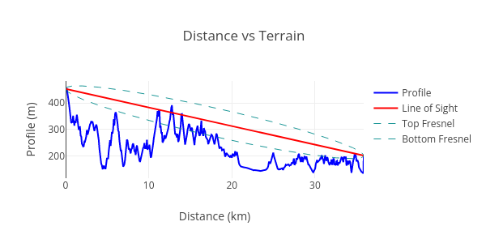
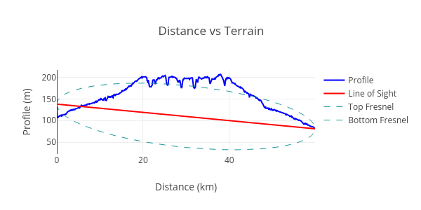
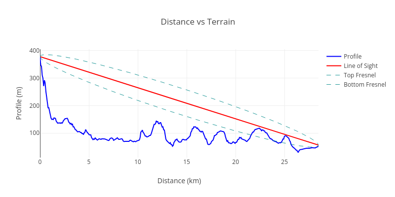

# Terrain Intersection Classifier in the PoC Pipeline

- Author(s): <!-- your GitHub @username -->
- Start Date: <!-- fill me in with today's date, YYYY-MM-DD -->
- Category: technical
- Original HIP PR: <!-- leave this empty; maintainer will fill in ID of this pull request -->
- Tracking Issue: <!-- leave this empty; maintainer will create a discussion issue -->
- Vote Requirements: <!-- veHNT Holders, veIOT Holders, or veMOBILE Holders -->

## Summary

[summary]: #summary

Beacon signals and data transmissions over the IoT network face significant propagation challenges across complex terrains, such as mountains or hills. Typically, effective signal reception occurs primarily when there's an unobstructed line of sight (LoS) between the transmitting and receiving devices. To enhance the integrity and reliability of the Helium Network's Proof of Coverage (PoC) process, this proposal introduces an additional verification step. This step aims to authenticate the line of sight between the declared locations of hotspots and their corresponding witnesses. Under this proposed mechanism, witness reports will be evaluated for LoS obstructions. Reports indicating a blocked LoS, which renders successful radio communication between the beaconer and the witness improbable, will be classified as *invalid*. This initiative is designed to improve network validation processes, ensuring that the PoC accurately reflects the physical and operational realities of radio communication.

## Motivation

[motivation]: #motivation

On January 13, 2022, the Helium community [approved](https://github.com/helium/HIP/blob/main/0040-validator-denylist.md) a proposal allowing Nova Labs to operate and enforce a [deny list](https://docs.helium.com/iot/denylist) aimed at addressing widespread abuse within the Helium Proof of Coverage (PoC) system. Subsequent enhancements in [August](https://docs.helium.com/devblog/2023/08/07/denylist-evolution/) and [September](https://docs.helium.com/devblog/2023/09/14/denylist-refine/) of 2023 introduced automated classifiers to the deny list process, analyzing PoC data to efficiently identify and mitigate abuse. 

One component of this enhanced system is the *Terrain Intersection Classifier*. Utilizing [data from the NASA Shuttle Radar Topography Mission](https://www2.jpl.nasa.gov/srtm/) (SRTM) alongside hotspots' asserted location information, this classifier assesses the presence of an unobstructed line of sight (LoS). When an obstructed LoS is detected, suggesting improbable successful radio communication between the beaconer and witness, the involved pair is added to the edge deny list. Their witness reports are marked as invalid due to `denied_edge`.

Having demonstrated its effectiveness and after significant refinement by Nova Labs, this algorithm is ready for deployment in the PoC pipeline. The essence of this proposal is to formalize its role within the Helium network by ensuring its permanent place in the PoC process, aligning it with the network's governance protocols.

While the deny list process currently incorporates a blend of automation and weekly human reviews, this change proposes a shift towards full automation. Such a transition would streamline operations and have the PoC accurately reflects real-world communication capabilities.

## Stakeholders

[stakeholders]: #stakeholders

This proposal directly affects hotspot owners, especially those whose connections have previously been marked with denied edges due to `terrain_intersection`. It's important to note that there will be no alterations to their reward structure; the financial incentives remain unchanged. The sole modification introduced by this proposal pertains to the classification of invalid witness reports. Rather than being labeled as `denied_edge`, these instances will now be identified specifically by the `terrain_intersection` reason. This adjustment aims to provide greater transparency and specificity regarding the cause of denied witness interactions.

## Detailed Explanation

[detailed-explanation]: #detailed-explanation

- Introduce and explain new concepts.
- It should be reasonably clear how the proposal would be implemented.
- Provide representative examples that show how this proposal would be commonly used.
- Corner cases should be dissected by example.

### Terrain-Aware Signal Verification

[terrain-aware-signal-verification]: #terrain-aware-signal-verification

Beacons and data sent over the IOT network do not propagate through significant terrain, such as mountains, or hills. Signals are generally only received if there is a clear line of sight between the transmitter and the receiver. The public NASA Shuttle Radar Topography Mission (SRTM) [data](https://www2.jpl.nasa.gov/srtm/) will be used to determine the terrain profile between hotspots. This terrain profile is used to evaluate the line of sight between the asserted locations of hotspots and their witnesses. This concept is illustrated below:

The line of sight between the transmitter and the receiver is shown in orange, and the terrain between them is blue. In this example, the line of sight is blocked and successful radio communication is unlikely. The amount of terrain blocking communication is measured by taking the area under the terrain curve and above the line of sight. This number will be zero for a perfect line of sight between the transmitter and the receiver, and large if it intersects significant terrain features. This measurement is called as “terrain intersection”.

Here is an example of the terrain intersection for a hotspot with abnormal behavior, and one which is correctly asserted:

Note the line of sight in the abnormal case goes through a very large amount of terrain.

Note that the line of sight is well above the terrain in the normal case. ~~The classifiers will allow some terrain intersections to account for some terrain overlap.~~ (*)

The witness report is marked as invalid when the terrain intersection for beacon and witness pair is unusually high.

### New Invalid Witness Reason: `terrain_intersection`

There will be a new invalid reason, `terrain_intersection`, which will signal the hotspot is reporting an impossible witness report for the beacon, because of terrain obstruction.

## Drawbacks

[drawbacks]: #drawbacks

The main drawback of this proposal is that it increases the complexity of the `iot_verifier` oracle and the poc verification pipeline in general. As this proposal primarily moves an existing mechanism (currently as part of the denylist) to the oracle pipeline we believe that the increased complexity is less of a maintenance burden than the manual intervention needed in the denylist mechanism.

## Rationale and Alternatives

[rationale-and-alternatives]: #rationale-and-alternatives

The current alternative to our proposed solution involves maintaining the existing practice, wherein edges subject to terrain obstructions are added to the denylist. However, integrating an automated system within the PoC pipeline presents a superior approach for several reasons:

1. **Reduction in Denylist Size**: By automating the identification and handling of terrain-obstructed connections directly within the PoC pipeline, we significantly decrease the volume of entries in the edges deny list. 
2. **Full Automation**: Transitioning to a fully automated process eliminates manual intervention, ensuring a more efficient, consistent, and error-resistant operation. 
3. **Incorporation into Helium Governance**: By integrating this major algorithm directly into the PoC pipeline, it becomes a part of the regular Helium network governance model. This shift ensures that critical components influencing the PoC process are managed under the network's established governance framework, promoting transparency and community oversight.

## Unresolved Questions

[unresolved-questions]: #unresolved-questions

- What parts of the design do you expect to resolve through the HIP process before this gets merged?
- What parts of the design do you expect to resolve through the implementation of this feature?
- What related issues do you consider out of scope for this HIP that could be addressed in the
  future independently of the solution that comes out of this HIP?
- Are there dependencies, milestones, or dates that need to be met for this HIP to succeed?

## Deployment Impact

[deployment-impact]: #deployment-impact

When this proposal passes and is deployed the `iot_verifier` oracle will be upgraded to the version including the proposed changes. After the `iot_verifier` update is successfully deployed the denylist process will cease to include the `terrain_intersection` metric the first denylist iteration _after_ deployment.

The explorers will have to implement the new invalid reason `terrain_intersection` to provide the user with correct feedback on why their hotspot is currently not considered for rewards.

The documentation will have to be changed to reflect the new invalid reasons `terrain_intersection`. 

## Success Metrics

[success-metrics]: #success-metrics

What metrics can be used to measure the success of this design? Are any new ETL reports needed to
measure the success?

- What should we measure to prove a performance increase?
- What should we measure to prove an improvement in stability?
- What should we measure to prove a reduction in complexity?
- What should we measure to prove an acceptance of this by its users?
